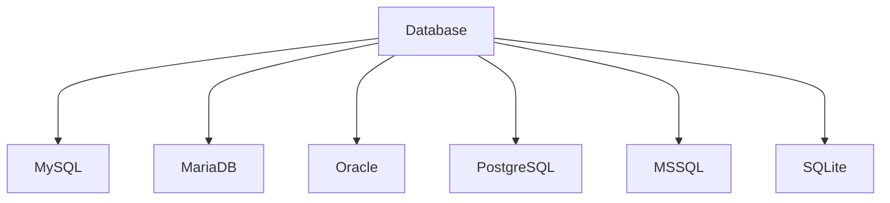

#
**Practical file**

1.*
**Comparative study of various Database Management Systems:-**
*
 
**-INTRODUCTION:-**
 
A Database Management System (DBMS) is a specialized software designed to store, retrieve, and manipulate data. It acts as a mediator between the database, applications, and user interfaces to manage and organize data effectively. The system provides a comprehensive suite of tools to govern databases, ensuring data security, consistency, and integrity.

A DBMS supports various applications, from simple storage and retrieval tasks to complex data-driven systems, by implementing efficient data access and management practices. Additionally, the system can handle concurrent users, maintain transactional consistency, and provide robust backup and recovery options, making it an essential component in any data-centric environment.

 

**i) My SQL:-**
 
MySQL is one of the most popular relational database systems. Originally an open-source solution, MySQL is now owned by Oracle Corporation. Today, MySQL is a pillar of LAMP application software. That means it’s a part of Linux, Apache, MySQL, and Perl/PHP/Python stack. Having C and C++ under the hood, MySQL works well with such system platforms as Windows, Linux, MacOS, IRIX, and others.
 
 
**Pros of MYSQL**
 
    -MySQL is a Relational Database Management System or RDBMS which means that it stores and presents data in tabular form, organized in rows and columns.
     
    -MySQL is more secure as it consists of a solid data security layer to protect sensitive data from intruders and passwords in MySQL are encrypted.
     
    -MySQL is available for free to download and use from the official site of MySQL.
     
    -MySQL is compatible with most of the operating systems, including Windows, Linux, NetWare, Novell, Solaris and other variations of UNIX.
     
    -MySQL provides the facility to run the clients and the server on the same computer or on different computers, via internet or local network.
     
    -MySQL has a unique storage engine architecture which makes it faster, cheaper and more reliable.
     
    -MySQL gives developers higher productivity by using views, Triggers and Stored procedures
     
    -MySQL is simple and easy to use. You can build and interact with MySQL with only the basic knowledge of MySQL and a few simple SQL statements.
     
    -MySQL has a client-server architecture. There can be any number of clients or application programs which communicate with the database server (MySQL) to query data, save changes, etc.
     
    -MySQL is scalable and capable of handling more than 50 million rows. This is enough to handle almost any amount of data. Although the default file size limit is 4GB but it can be increased to 8TB.
     
    -MySQL allows transactions to be rolled back.
     
    -MySQL is very flexible as it supports a large number of embedded applications.
 
 
**Cons of MYSQL**
 
    -MySQL is not very efficient in handling very large databases.
     
    -MySQL doesn’t have as good a developing and debugging tool as compared to paid databases.
     
    -MySQL versions less than 5.0 do not support COMMIT, stored procedure and ROLE.
     
    -MySQL is prone to data corruption as it inefficient in handling transactions.
     
    -MySQL does not support SQL check constraints.
 
 
**ii) MariaDB:-**
 
The community edition of MySQL is free to download. With a basic set of tools for individual use, MySQL community edition is a good option, to begin with. Of course, there are other, prepaid versions for Enterprise or Cluster purposes with richer functionality. Nevertheless, if your company is too small to pay for one of them, the free-to-download model is the most suitable for a fresh start.
 
 

