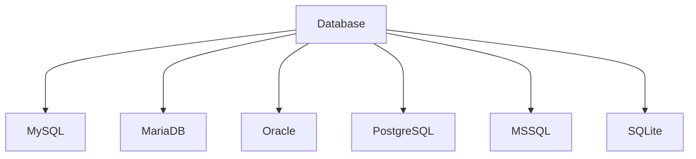
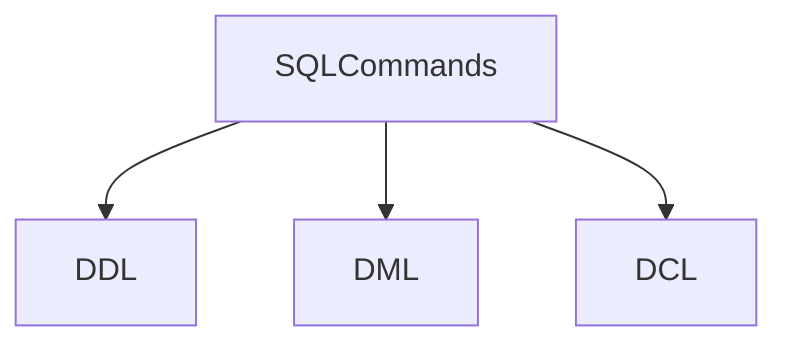

##### EXPERIMENT:-1
Comparative study of various Database Management Systems:-
<br>
**-INTRODUCTION:-**
<br>
A Database Management System (DBMS) is a specialized software designed to store, retrieve, and manipulate data. It acts as a mediator between the database, applications, and user interfaces to manage and organize data effectively. The system provides a comprehensive suite of tools to govern databases, ensuring data security, consistency, and integrity.

A DBMS supports various applications, from simple storage and retrieval tasks to complex data-driven systems, by implementing efficient data access and management practices. Additionally, the system can handle concurrent users, maintain transactional consistency, and provide robust backup and recovery options, making it an essential component in any data-centric environment.


<br>

**i) My SQL:-**
<br>
MySQL is one of the most popular relational database systems. Originally an open-source solution, MySQL is now owned by Oracle Corporation. Today, MySQL is a pillar of LAMP application software. That means it’s a part of Linux, Apache, MySQL, and Perl/PHP/Python stack. Having C and C++ under the hood, MySQL works well with such system platforms as Windows, Linux, MacOS, IRIX, and others.
<br>
<br>
**Pros of MYSQL**
<br>
    -MySQL is a Relational Database Management System or RDBMS which means that it stores and presents data in tabular form, organized in rows and columns.
    <br>
    -MySQL is more secure as it consists of a solid data security layer to protect sensitive data from intruders and passwords in MySQL are encrypted.
    <br>
    -MySQL is available for free to download and use from the official site of MySQL.
    <br>
    -MySQL is compatible with most of the operating systems, including Windows, Linux, NetWare, Novell, Solaris and other variations of UNIX.
    <br>
    -MySQL provides the facility to run the clients and the server on the same computer or on different computers, via internet or local network.
    <br>
    -MySQL has a unique storage engine architecture which makes it faster, cheaper and more reliable.
    <br>
    -MySQL gives developers higher productivity by using views, Triggers and Stored procedures
    <br>
    -MySQL is simple and easy to use. You can build and interact with MySQL with only the basic knowledge of MySQL and a few simple SQL statements.
    <br>
    -MySQL has a client-server architecture. There can be any number of clients or application programs which communicate with the database server (MySQL) to query data, save changes, etc.
    <br>
    -MySQL is scalable and capable of handling more than 50 million rows. This is enough to handle almost any amount of data. Although the default file size limit is 4GB but it can be increased to 8TB.
    <br>
    -MySQL allows transactions to be rolled back.
    <br>
    -MySQL is very flexible as it supports a large number of embedded applications.
<br>
<br>
**Cons of MYSQL**
<br>
    -MySQL is not very efficient in handling very large databases.
    <br>
    -MySQL doesn’t have as good a developing and debugging tool as compared to paid databases.
    <br>
    -MySQL versions less than 5.0 do not support COMMIT, stored procedure and ROLE.
    <br>
    -MySQL is prone to data corruption as it inefficient in handling transactions.
    <br>
    -MySQL does not support SQL check constraints.
<br>
<br>
**ii) MariaDB:-**
<br>
The community edition of MySQL is free to download. With a basic set of tools for individual use, MySQL community edition is a good option, to begin with. Of course, there are other, prepaid versions for Enterprise or Cluster purposes with richer functionality. Nevertheless, if your company is too small to pay for one of them, the free-to-download model is the most suitable for a fresh start.
<br>
<br>
**Pros of MariDB**
<br>
-Encryption. For MariaDB, open source doesn’t mean insecure. In addition to internal security and password check, MariaDB provides such features as PAM and LDAP authentication, Kerberos, and user roles. Combined with encrypted tablespaces, tables, and logs, it creates a robust protective layer for data. Beyond that, MariaDB publishes related releases on each security update, keeping the security patches totally transparent.

-Broad functionality. MariaDB has introduced a lot of new features in the last few years. For instance, GIS support suggests smooth coordinate storage and location data queries. Dynamic columns allow a single DBMS to provide both SQL and NoSQL data handling for different needs. You can also extend its functionality with plugins that are available at MySQL via 3rd parties only. MariaDB is shipped with storage engines for NoSQL backend, legacy database migration tools, sharding options, and much more.

-High performance. Although MariaDB originates from the MySQL engine, it's gotten very far in terms of performance. Extensive optimization features improve thread pool management and data processing. Thus, when rows from the table are deleted, the operating system immediately accesses the free space, eliminating gaps in the tablespace. On top of that, the database management system suggests engine-independent table statistics. This feature enhances the optimizer’s performance, accelerates query processing, and helps customize data analysis.
<br>
<br>
**Cons of MariDB**
<br>
-Still a growing community. Although MariaDB has substantial open-source contribution, its community has yet to grow much. Since this database management system was established not so long ago, the number of professionals involved is relatively small.

-Gaps between MySQL and MariaDB update versions. Though the MariaDB team is constantly merging its code with MySQL's, it’s already not that simple to keep them in line. Given the currently existing differences between MariaDB 10.6 and MySQL 8.0.32, further deviations are yet to come. Additionally, MySQL engineers introduced some native features to the code that are only available to commercial MySQL users. This can create compatibility issues or data migration problems from MariaDB back to MySQL.
<br>
<br>
**Oracle:-**
<br>
Oracle is a relational database management system created and run by the Oracle Corporation. Among all the types of SQL databases, Oracle stands out. Currently, it supports multiple data models like document, graph, relational, and key-value within a single database. In its latest releases, it refocused on cloud computing. Oracle database engine licensing is fully proprietary, with both free and paid options available.
<br>
<br>
**Pros of Oracle**
<br>
-Innovations for daily workflow. Starting with the Oracle 12c release, when the software entered the hybrid cloud era, new cloud computing technologies appeared regularly. With every new release, Oracle tries to keep up with the innovation pace while focusing on information security, including active data guard, partitioning, improved backup, and recovery.

-Strong tech support and documentation. Oracle ensures decent customer support and provides comprehensive tech documentation across multiple resources. So, you’ll likely find solutions to any issues that appear. You may also expect some community support.

-Large capacity. Oracle’s multi-model solution allows for accommodating and processing a vast amount of data. Thanks to the recently released multi-tenancy feature, the database architecture now simplifies packing many databases and manages them smoothly. In combination with in-memory data processing capabilities, it creates a strong engine for synchronous data processing.
<br>
<br>
**Cons of Oracle**
<br>
-High cost. Though the Oracle database has free editions, they are very limited in terms of functionality. Standard Edition, which doesn’t include all available features, costs $17,500 per unit. The Enterprise Edition is over $47,000 per unit.

-Resource-consuming technology. The Oracle database needs powerful infrastructure. Not only does installation require a lot of disk space, but you’ll also have to consider constant hardware updates if you deploy it on-premises.

-Hard learning curve. Oracle database is not a system to start using right away. It’s better to have certified Oracle DB engineers to run it. Oracle’s documentation, while covering many issues, can sometimes be overwhelming and even confusing. So, to install and run an Oracle database, you’ll have to consider hiring dedicated experts.
<br>
<br>
**PostgreSQL:-**
<br>
The PostgreSQL database management system shares its popularity with MySQL. This is an object-relational DBMS where user-defined objects and table approaches are combined to build more complex data structures. Besides that, PostgreSQL has a lot of similarities with MySQL. It’s aimed at strengthening the standards of compliance and extensibility. Consequently, it can process any workload, for both single-machine products and complex applications. Owned and developed by PostgreSQL Global Development Group, it still remains completely open-source. This DBMS is available for use with platforms like Microsoft, iOS, Android, and many more.
<br>
<br>
**Pros of PostgreSQL**
<br>
-Great scalability. Vertical scalability is a hallmark of PostgreSQL. Considering that almost any custom software solution tends to grow, resulting in database extension, this particular option certainly supports business growth and development.

-Support for custom data types. PostgreSQL natively supports many data types by default, such as JSON, XML, H-Store, and others. PostgreSQL takes advantage of it, being one of the few relational databases with strong support for NoSQL features. Additionally, it allows users to define their own data types. As your software business model may need different types of databases throughout its existence for better performance or application comprehensiveness, this option brings improved flexibility to the table.

-Easily-integrated third-party tools. The PostgreSQL database management system has the strong support of additional tools, both free and commercial. The scope of these includes extensions to improve many aspects. For example, ClusterControl provides impressive assistance in managing, monitoring, and scaling SQL and NoSQL open-source databases. To make data comparison and synchronization more effective, consider using DB Data Directive. In case you’re going to scale up your data to heavy workloads, the pgBackRest backup and restore system will be a nice option to choose from.

-Open-source and community-driven support. Postgres is completely open-source and supported by its community, strengthening it as a complete ecosystem. Additionally, developers can always expect free and prompt community assistance.
<br>
<br>
**Cons of PostgreSQL**
<br>
-Inconsistent documentation. While PostgreSQL has a large community and strongly supports its participants, the documentation still lacks consistency and completeness. As the PostgreSQL community is rather distributed, the documentation doesn’t follow uniform standards for all Postgre features.

-Lack of reporting and auditing instruments. A significant shortcoming of PostgreSQL is the absence of revising tools that would show the current condition of a database. You have to continuously check if something goes wrong. There’s always a risk that DB engineers will notice a failure too late.
<br>
<br>
**MSSQL:-**
<br>
As a completely commercial tool, Microsoft SQL Server is one of the most popular relational DBMSs, in addition to MySQL, PostgreSQL, and Oracle. It copes well with effective storing, changing, and managing relational data. To interact with SQL Server databases, DB engineers usually utilize the Transact-SQL (T-SQL) language, which is an extension of the SQL standard.
<br>
<br>
**Pros of MSSQL**
<br>
-Variety of versions. Microsoft SQL Server provides a wide choice of different options with diverse functionalities. For instance, the Express edition with a free database offers entry-level tooling, the perfect match for learning and building desktop or small server data-driven applications. The Developers option allows for building and testing applications, including some enterprise functionalities, but without a production server license. For bigger projects, there are also Web, Standard, and Enterprise editions, with a varying extent of administrative capabilities and service levels.

-End-to-end business data solution. With a focus on mostly commercial solutions, MSSQL provides a lot of business value-added features. The optional selection of components allows building ETL solutions, forming a knowledge base, and implementing data clearance. Also, it provides tools for overall data administration, online analytical processing, and data mining, additionally offering solutions for report and visualization generation.

-Rich documentation and community assistance. With Microsoft SQL Server aimed at comprehensive database maintenance, the full online documentation also reflects this concept. The correspondingly structured guidelines, numerous whitepapers, and demos give a full picture of the MSSQL data system. Also, Microsoft Premier provides access to dedicated Microsoft community support, which is an advantage when a DB engineer needs assistance.

-Cloud database support. A part of the consistent Microsoft ecosystem, MSSQL can be integrated with Microsoft Cloud, Azure SQL Database, or SQL Server on Azure Virtual Machines. The solutions allow shifting database administration to the cloud if your business software database becomes really overwhelming and hard to administer.
<br>
<br>
**Cons of MSSQL**
<br>
-High cost. Being mostly used at the enterprise scale, MSSQL Server remains one of the most expensive solutions. Speaking of numbers, the Enterprise edition currently costs over $15, 123 per core, sold as 2 core packs.

-Unclear and floating license conditions. Another issue is the ever-changing licensing process. The pricing strategy itself is hard to understand, and the elements included in a particular edition are floating, tending to shift from one to another.

-Complicated tuning process. For those beginners who have to operate heavy data sets, working with query optimization and performance tuning may be problematic. As the process is not so obvious, it can create substantial bottlenecks early on.
<br>
<br>
**SQLite:-**
<br>
SQLite is a self-sufficient, serverless, and no-configuration-required database management system. Frequently utilized as an embedded database, it is popular for small-scale mobile and desktop applications.
<br>
<br>
**Pros of SQLite**
<br>
-Small in size and easily portable. SQLite is a streamlined database engine that operates without a separate server process. The entire database is contained within a single cross-platform disk file, enhancing its portability and simplifying its integration into applications.

-Minimal resource consumption. SQLite is engineered for optimal memory and disk space efficiency, making it an ideal choice for applications with constrained resources, such as those found in mobile and IoT devices.

-Reliable and user-friendly. SQLite is an ACID-compliant database, ensuring the integrity and consistency of data. Additionally, it is simple to set up and demands minimal configuration.
<br>
<br>
**Cons of SQLite**
<br>
-Restricted concurrency. SQLite employs file-based locking, limiting its capacity to manage multiple concurrent write operations. This makes it less appropriate for applications with high write concurrency or multiple users accessing the database simultaneously.

-Absence of advanced features. SQLite lacks some of the sophisticated features found in other database management systems, such as stored procedures, triggers, or user-defined functions.
-Restricted scalability. Owing to its serverless structure, SQLite is not tailored for extensive applications or distributed settings. Its performance may diminish when handling substantial datasets or elevated levels of concurrent access.
<br>
<br>
<br>

###### EXPERIMENT:-2
-Data Definition Language(DDL), Data Manipulation Language(DML), Data Control Language(DCL).
<br>
<br>
**:-SQL** commands are like instructions to a table. It is used to interact with the database with some operations. It is also used to perform specific tasks, functions, and queries of data. SQL can perform various tasks like creating a table, adding data to tables, dropping the table, modifying the table, set permission for users.



**DDL(Data Defination Language):-**
<br>
DDL or Data Definition Language actually consists of the SQL commands that can be used to define the database schema. It simply deals with descriptions of the database schema and is used to create and modify the structure of database objects in the database. DDL is a set of SQL commands used to create, modify, and delete database structures but not data. These commands are normally not used by a general user, who should be accessing the database via an application.
<br>
List of DDL commands: 

    -CREATE: This command is used to create the database or its objects (like table, index, function, views, store procedure, and triggers).
    -DROP: This command is used to delete objects from the database.
    -ALTER: This is used to alter the structure of the database.
    -TRUNCATE: This is used to remove all records from a table, including all spaces allocated for the records are removed.
    -COMMENT: This is used to add comments to the data dictionary.
    -RENAME: This is used to rename an object existing in the database.
<br>

**DML(Data Manipulation Language):-**
<br>
The SQL commands that deal with the manipulation of data present in the database belong to DML or Data Manipulation Language and this includes most of the SQL statements. It is the component of the SQL statement that controls access to data and to the database. Basically, DCL statements are grouped with DML statements.

List of DML commands: 

    -INSERT: It is used to insert data into a table.
    -UPDATE: It is used to update existing data within a table.
    -DELETE: It is used to delete records from a database table.
    -LOCK: Table control concurrency.
    -CALL: Call a PL/SQL or JAVA subprogram.
    -EXPLAIN PLAN: It describes the access path to data.
<br>

**DCL (Data Control Language):-**

DCL includes commands such as GRANT and REVOKE which mainly deal with the rights, permissions, and other controls of the database system. 

List of  DCL commands: 

GRANT: This command gives users access privileges to the database.

Syntax:

    GRANT SELECT, UPDATE ON MY_TABLE TO SOME_USER, ANOTHER_USER;  

REVOKE: This command withdraws the user’s access privileges given by using the GRANT command.

Syntax:

    REVOKE SELECT, UPDATE ON MY_TABLE FROM USER1, USER2;  
<br>
<br>

###### EXPERIMENT:-3
-How to apply Constraints at variable levels.
<br>
###### Constraints in SQL
###### Constraints in SQL means we are applying certain conditions or restrictions on the database. This further means that before inserting data into the database, we are checking for some conditions. If the condition we have applied to the database holds true for the data which is to be inserted, then only the data will be inserted into the database tables.
##### Constraints in SQL can be categorized into two types:
 ######   1. Column Level Constraint:
##### Column Level Constraint is used to apply a constraint on a single column.
  ###### 2. Table Level Constraint:
###### Table Level Constraint is used to apply a constraint on multiple columns.
###### Constraints available in SQL are:
######    1. NOT NULL
######    2. UNIQUE
######    3. PRIMARY KEY
######    4. FOREIGN KEY
######    5. CHECK
######    6. DEFAULT
######    7. CREATE INDEX
###### Now let us try to understand the different constraints available in SQL in more detail with the help of examples. We will use MySQL database for writing all the queries.
##### 1. NOT NULL
    * NULL means empty, i.e., the value is not available.
    * Whenever a table's column is declared as NOT NULL, then the value for that column cannot be empty for any of the table's records.
    * There must exist a value in the column to which the NOT NULL constraint is applied.
######   CREATE TABLE TableName (ColumnName1 datatype NOT NULL, ColumnName2 datatype,…., ColumnNameN datatype);
##### Example:
###### Create a student table and apply a NOT NULL constraint on one of the table's column while creating a table.
<b>```1.CREATE TABLE student(StudentID INT NOT NULL, Student_FirstName VARCHAR(20), Student_LastName VARCHAR(20), Student_PhoneNumber VARCHAR(20), Student_Email_ID VARCHAR(40));```</b>  


To verify that the not null constraint is applied to the table's column and the student table is created successfully, we will execute the following query:
   ##### 1. mysql> DESC student;  
  
##### 2. UNIQUE
    * Duplicate values are not allowed in the columns to which the UNIQUE constraint is applied.
    * The column with the unique constraint will always contain a unique value.
    * This constraint can be applied to one or more than one column of a table, which means more than one unique constraint can exist on a single table.
    * Using the UNIQUE constraint, you can also modify the already created tables.
##### Syntax to apply the UNIQUE constraint on a single column:
   <b> ```1. CREATE TABLE TableName (ColumnName1 datatype UNIQUE, ColumnName2 datatype,…., ColumnNameN datatype);``` </b>  
##### Example:
##### Create a student table and apply a UNIQUE constraint on one of the table's column while creating a table.
##### 1.mysql> CREATE TABLE student(StudentID INT UNIQUE, Student_FirstName VARCHAR(20), Student_LastName VARCHAR(20), Student_PhoneNumber VARCHAR(20), Student_Email_ID VARCHAR(40));  
    
To verify that the unique constraint is applied to the table's column and the student table is created successfully, we will execute the following query:
   ##### 1. mysql> DESC student;  
    
##### 3. PRIMARY KEY
    
* PRIMARY KEY Constraint is a combination of NOT NULL and Unique constraints.
    * NOT NULL constraint and a UNIQUE constraint together forms a PRIMARY constraint.

ps://github.com/Ajblaster/rdbms_2023batch/assets/146934019/030f5a3f-32f4-4689-a0de-962264a0614f)
    * The column to which we have applied the primary constraint will always contain a unique value and will not allow null values.
##### Syntax of primary key constraint during table creation:
  <b>  ```1. CREATE TABLE TableName (ColumnName1 datatype PRIMARY KEY, ColumnName2 datatype,…., ColumnNameN datatype);``` </b>  
###### Example:
###### Create a student table and apply the PRIMARY KEY constraint while creating a table.
<b> ```1.mysql> CREATE TABLE student(StudentID INT PRIMARY KEY, Student_FirstName VARCHAR(20), Student_LastName VARCHAR(20), Student_PhoneNumber VARCHAR(20), Student_Email_ID VARCHAR(40));``` </b>  
##### 4. FOREIGN KEY
    * A foreign key is used for referential integrity.
    * When we have two tables, and one table takes reference from another table, i.e., the same column is present in both the tables and that column acts as a primary key in one table. That particular column will act as a foreign key in another table.
Syntax to apply a foreign key constraint during table creation:
<b> ```CREATE TABLE tablename(ColumnName1 Datatype(SIZE) PRIMARY KEY, ColumnNameN Datatype(SIZE), FOREIGN KEY( ColumnName ) REFERENCES PARENT_TABLE_NAME(Primary_Key_ColumnName));``` </b>  
##### Example:
###### Create an employee table and apply the FOREIGN KEY constraint while creating a table.
###### To create a foreign key on any table, first, we need to create a primary key on a table.
  <b> ``` mysql> CREATE TABLE employee (Emp_ID INT NOT NULL PRIMARY KEY, Emp_Name VARCHAR (40), Emp_Salary VARCHAR (40)); ``` </b>
##### 5. CHECK
    * Whenever a check constraint is applied to the table's column, and the user wants to insert the value in it, then the value will first be checked for certain conditions before inserting the value into that column.
    * For example: if we have an age column in a table, then the user will insert any value of his choice. The user will also enter even a negative value or any other invalid value. But, if the user has applied check constraint on the age column with the condition age greater than 18. Then in such cases, even if a user tries to insert an invalid value such as zero or any other value less than 18, then the age column will not accept that value and will not allow the user to insert it due to the application of check constraint on the age column.
Syntax to apply check constraint on a single column:
 <b>  ``` 1. CREATE TABLE TableName (ColumnName1 datatype CHECK (ColumnName1 Condition), ColumnName2 datatype,…., ColumnNameN datatype);``` </b>  
##### Example:
##### Create a student table and apply CHECK constraint to check for the age less than or equal to 15 while creating a table.
    <b> ```1. mysql> CREATE TABLE student(StudentID INT, Student_FirstName VARCHAR(20), Student_LastName VARCHAR(20), Student_PhoneNumber VARCHAR(20), Student_Email_ID VARCHAR(40), Age INT CHECK( Age <= 15));``` </b>
   ##### 6. DEFAULT
###### Whenever a default constraint is applied to the table's column, and the user has not specified the value to be inserted in it, then the default value which was specified while applying the default constraint will be inserted into that particular column.
###### Syntax to apply default constraint during table creation:
  <b> ```  1. CREATE TABLE TableName (ColumnName1 datatype DEFAULT Value, ColumnName2 datatype,…., ColumnNameN datatype);  ``` </b>
##### Example:
###### Create a student table and apply the default constraint while creating a table.
<b>```mysql> CREATE TABLE student(StudentID INT, Student_FirstName VARCHAR(20), Student_LastName VARCHAR(20), Student_PhoneNumber VARCHAR(20), Student_Email_ID VARCHAR(40) DEFAULT "anuja.k8@gmail.com");``` </b>
##### 7. CREATE INDEX
###### CREATE INDEX constraint is used to create an index on the table. Indexes are not visible to the user, but they help the user to speed up the searching speed or retrieval of data from the database.
###### Syntax to create an index on single column:
   ##### 1. CREATE INDEX IndexName ON TableName (ColumnName 1);  
###### Example:
###### Create an index on the student table and apply the default constraint while creating a table.
 <b>```1. mysql> CREATE INDEX idx_StudentID ON student (StudentID);```</b>  
## Experiment:- 4
### View data in the required form using Operators, Functions and Joins.
###### An SQL operator is a reserved word or a character used primarily in an SQL statement's WHERE clause to perform operation(s), such as comparisons and arithmetic operations. These Operators are used to specify conditions in an SQL statement and to serve as conjunctions for multiple conditions in a statement.

###### An SQL operator can be either a unary or binary operator. A unary operator (example unary + or unary - ) uses only one operand to perform the unary operation, whereas the binary operator (example + or - etc) uses two operands to perform the binary operation.

##### SQL supports following types of operators:

* Arithmetic operators
* Comparison operators
* Logical operators

<b>SQL Arithmetic Operators</b>
###### SQL Arithmetic Operators are used to perform mathematical operations on the numerical values. SQL provides following operators to perform mathematical operations.

###### Here is a list of all the arithmetic operators available in SQL.
|Operator	| Description	 | Example     |
|:-------:|:------------:|:-----------:|
|+        |Addition	     |10 + 20 = 30 |
|-        |Subtraction	 |20 - 30 = -10|
|*	      |Multiplication|10 * 20 = 200|
|/      	|Division	     |20 / 10 = 2  |
|%	      |Modulus	     |5 % 2 = 1    |

#### SQL Comparison Operators
##### SQL Comparison Operators test whether two given expressions are the same or not. These operators are used in SQL conditional statements while comparing one expression with another and they return a Boolean value which can be either TRUE or FALSE. The result of an SQL comparison operation can be UNKNOWN when one or another operand has it's value as NULL.

##### Here is a list of all the comparison operators available in SQL.

|Operator  | Description	            | Example           |
|:--------:|:------------------------:|:-----------------:|
| =	       |Equal to	                |5 = 5 returns TRUE |
| !=	     | Not equal	              |5 != 6 returns TRUE|
| <>       |Not equal	                |5 <> 4 returns TRUE|
| >	       |Greater than	            |4 > 5 returns FALSE|
| <        |Less than	                |4 < 5 returns TRUE |
| >=       |Greater than or equal to  |4 >= 5 returns FALSE|
| <=       |Less than or equal to	    |4 <= 5 returns TRUE|
| !<       |Not less than	            |4 !< 5 returns FALSE|
| !>       |Not greater than        	|4 !> 5 returns TRUE

##### SQL Logical Operators
##### SQL Logical Operators are very similar to comparison operators and they test for the truth of some given condition. These operators return a Boolean value which can be either a TRUE or FALSE. The result of an SQL logical operation can be UNKNOWN when one or another operand has it's value as NULL.

##### Here is a list of all the logical operators available in SQL.

|Operator |	Description	|
|:-------:|:-----------:|
|ALL |	TRUE if all of a set of comparisons are TRUE.	|
|AND |	TRUE if all the conditions separated by AND are TRUE.|	
|ANY |TRUE if any one of a set of comparisons are TRUE.	|
|BETWEEN	|TRUE if the operand lies within the range of comparisons. |
|EXISTS	|TRUE if the subquery returns one or more records	|
|IN	|TRUE if the operand is equal to one of a list of expressions. |	
|LIKE|	TRUE if the operand matches a pattern specially with wildcard. |	
|NOT	|Reverses the value of any other Boolean operator.	|
|OR	|TRUE if any of the conditions separated by OR is TRUE	|
|IS |NULL	TRUE if the expression value is NULL.	|
|SOME	|TRUE if some of a set of comparisons are TRUE. |	
|UNIQUE|	The UNIQUE operator searches every row of a specified table for uniqueness (no duplicates). |	

<b>SQL | Join (Inner, Left, Right and Full Joins)</b>
##### SQL Join statement is used to combine data or rows from two or more tables based on a common field between them. Different types of Joins are as follows: 

* INNER JOIN
* LEFT JOIN
* RIGHT JOIN
* FULL JOIN
* NATURAL JOIN 
##### Consider the two tables below as follows: 
##### Student
##### Student


##### StudentCourse 

##### The simplest Join is INNER JOIN. 
#### A. INNER JOIN
##### The INNER JOIN keyword selects all rows from both the tables as long as the condition is satisfied. This keyword will create the result-set by combining all rows from both the tables where the condition satisfies i.e value of the common field will be the same. 

##### Syntax: 

```SELECT table1.column1,table1.column2,table2.column1,....```
```FROM table1 ```<br>
```INNER JOIN table2```<br>
```ON table1.matching_column = table2.matching_column;```<br>


```table1: First table.```<br>
```table2: Second table```
##### matching_column: Column common to both the tables.

##### Example Queries(INNER JOIN)

##### This query will show the names and age of students enrolled in different courses.  
```SELECT StudentCourse.COURSE_ID, Student.NAME, Student.AGE FROM Student```
```INNER JOIN StudentCourse```
```ON Student.ROLL_NO = StudentCourse.ROLL_NO;```
##### Output:  


#### B. LEFT JOIN
##### This join returns all the rows of the table on the left side of the join and matches rows for the table on the right side of the join. For the rows for which there is no matching row on the right side, the result-set will contain null. LEFT JOIN is also known as LEFT OUTER JOIN.

##### Syntax: 

```SELECT table1.column1,table1.column2,table2.column1,....```
```FROM table1 ```<br>
```LEFT JOIN table2```<br>
```ON table1.matching_column = table2.matching_column;```<br>


```table1: First table.```<br>
```table2: Second table```
##### matching_column: Column common to both the tables.

##### Example Queries(LEFT JOIN): 

```SELECT Student.NAME,StudentCourse.COURSE_ID ```
```FROM Student```<br>
```LEFT JOIN StudentCourse ```<br>
```ON StudentCourse.ROLL_NO = Student.ROLL_NO;```<br>
##### Output: 


#### C. RIGHT JOIN
##### RIGHT JOIN is similar to LEFT JOIN. This join returns all the rows of the table on the right side of the join and matching rows for the table on the left side of the join. For the rows for which there is no matching row on the left side, the result-set will contain null. RIGHT JOIN is also known as RIGHT OUTER JOIN. 
##### Syntax: 
```SELECT table1.column1,table1.column2,table2.column1,....```
```FROM table1``` <br>
```RIGHT JOIN table2```<br>
```ON table1.matching_column = table2.matching_column;```<br>
```table1: First table.```<br>
```table2: Second table```<br>
##### matching_column: Column common to both the tables.

##### Example Queries(RIGHT JOIN):

```SELECT Student.NAME,StudentCourse.COURSE_ID ```
```FROM Student```<br>
```RIGHT JOIN StudentCourse ```<br>
```ON StudentCourse.ROLL_NO = Student.ROLL_NO;```<br>
##### Output: 


#### D. FULL JOIN
##### FULL JOIN creates the result-set by combining results of both LEFT JOIN and RIGHT JOIN. The result-set will contain all the rows from both tables. For the rows for which there is no matching, the result-set will contain NULL values.

##### Syntax:  

```SELECT table1.column1,table1.column2,table2.column1,....```
```FROM table1 ```<br>
```FULL JOIN table2```<br>
```ON table1.matching_column = table2.matching_column;```<br>


```table1: First table.```<br>
```table2: Second table```<br>
```matching_column: Column common to both the tables. ```
## Experiment:- 5
#### 1. SIMPLE view: - Simple views are the most basic type of view in MariaDB. They are created by selecting a subset of columns from one or more tables.
    IMAGE
  #### 2. JOIN view: - Join views allow you to combine data from multiple tables and present it as a single view. You can create views that perform joins on underlying tables to simplify complex queries.
  IMAGE

  ## EXPERIMENT:- 6
  #### How to apply Conditional Controls in Pl/SQL
  ##### In this chapter, we will discuss conditions in PL/SQL. Decision-making structures require that the programmer specify one or more conditions to be evaluated or tested by the program, along with a statement or statements to be executed if the condition is determined to be true, and optionally, other statements to be executed if the condition is determined to be false.

##### Following is the general form of a typical conditional (i.e., decision making) structure found in most of the programming languages −


#####  1. IF Statement: - You can use the IF statement to execute different SQL statements based on a condition.

##### 2. CASE Statement: - The CASE statement allows you to perform conditional logic within SQL queries. You can use it to return different values based on specific conditions.
IMAGE
 ## EXPERIMENT:- 7
 #### Error Handling using Internal Exceptions and External Exceptions.
##### MariaDB supports error handling through both internal exceptions and external exceptions. Internal exceptions are typically used within stored procedures, while external exceptions are errors that can be caught in the client application that calls the database.
##### 1. Internal Exception (in Stored Procedures): -


##### 2. External Exception (in Stored Procedure): -
Image
 ## EXPERIMENT:- 8
 #### Using various types of Cursors
 ##### A Cursor is a temporary memory that is allocated by the database server at the time of performing the Data Manipulation Language operations on a table, such as INSERT, UPDATE and DELETE etc. It is used to retrieve and manipulate data stored in the SQL table.
#### Properties of Cursors

##### Following are the properties of MySQL Cursors −

```* READ ONLY − We cannot update or modify any records in the table using the MySQL cursors. We can just fetch and process data from a table.```

 ```  * Non-Scrollable − We can retrieve records from a table in a single direction, i.e. from the first record or the last. We cannot move backward or jump to a specific position within the result set.```

 ```  * Asensitive Cursor − An asensitive cursor operates directly on the actual data in the database, it does not create a copy of the data. If any change is made to the data by other connections, it can affect the data that the cursor is working with.```
#### Life Cycle of the Cursor

##### There are four steps to manage these cursors. Following diagram illustrates the lifecycle of an SQL cursor −

#### Declare Cursor Statement

##### In MySQL we can declare a cursor using the DECLARE statement and associate it with a SELECT statement to retrieve records from a database table.

##### However, this SELECT statement associated with a cursor does not use the INTO clause, as it's purpose is to fetch and process rows rather than assigning values to variables.
#### Syntax

##### Following is the syntax to declare a cursor in MySQL database −
```DECLARE cursor_name CURSOR FOR select_statement;```

#### Open Cursor Statement

##### After declaring a cursor in MySQL, the next step is to open the cursor using the OPEN statement. It initializes the result-set, allowing us to fetch and process rows from the associated SELECT statement in the cursor.
#### Syntax

##### Following is the syntax to open a cursor in MySQL database −

```OPEN cursor_name;```

#### Fetch Cursor Statement

##### Then, we can use the FETCH statement to retrieve the current row pointed by the cursor, and with each FETCH, the cursor moves to the next row in the result set. This allows us to process each row one by one.
#### Syntax

##### Following is the syntax to fetch a cursor in MySQL database −

```FETCH cursor_name INTO variable_list;```
#### Close Cursor Statement

##### Once all the rows are fetched, we must close the cursor to release the memory associated with it. We can do this using the CLOSE statement.
#### Syntax

##### Following is the syntax to close a cursor in MySQL database −

```CLOSE cursor_name;```

##### Example

##### In this example, let us see how to manage a cursor in a stored procedure.

##### Assume we have created a table with the name CUSTOMERS using the CREATE TABLE statement as follows −

##### Now, let us insert some records into the CUSTOMERS table using the INSERT statement as follows −

##### Now, we will create a backup table named 'CUSTOMERS_BACKUP' to store customer data −

##### Here, we are creating a stored procedure named FetchCustomers to fetch customer names from the CUSTOMERS table and inserting them one by one into the BACKUP table. We are using a cursor to iterate through the rows and a handler to detect the end of the result-set, ensuring all names are processed − 

##### Once we create the procedure successfully, we can execute it using the CALL statement as shown below −
## EXPERIMENT:- 9
#### How to run Stored Procedures and Functions
##### 1. STORED PROCEDURE: - You can create stored procedures in MariaDB to encapsulate conditional logic and reuse it in multiple queries or applications. Here's an example of a simple stored procedure with conditional logic:


##### 2. STORED FUNCTION: - In MariaDB, a function is a stored program that you can pass parameters into and then return a value.


## EXPERIMENT:- 10
#### Creating Packages and applying Triggers
##### Trigger is invoked by Oracle engine automatically whenever a specified event occurs.Trigger is stored into database and invoked repeatedly, when specific condition match.

##### Triggers are stored programs, which are automatically executed or fired when some event occurs.

##### Triggers are written to be executed in response to any of the following events.

  * A database manipulation (DML) statement (DELETE, INSERT, or UPDATE).
  * A database definition (DDL) statement (CREATE, ALTER, or DROP).
   * A database operation (SERVERERROR, LOGON, LOGOFF, STARTUP, or SHUTDOWN).
Advantages of Triggers

*  Trigger generates some derived column values automatically
* Enforces referential integrity
*   Event logging and storing information on table access
*  Auditing
*   Synchronous replication of tables
*    Imposing security authorizations
*   Preventing invalid transactions

