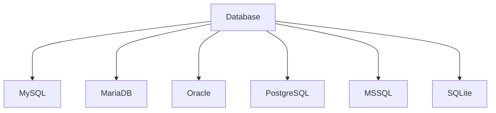

#
**Practical file**

1.*
**Comparative study of various Database Management Systems:-**
*
 
**-INTRODUCTION:-**
 
A Database Management System (DBMS) is a specialized software designed to store, retrieve, and manipulate data. It acts as a mediator between the database, applications, and user interfaces to manage and organize data effectively. The system provides a comprehensive suite of tools to govern databases, ensuring data security, consistency, and integrity.

A DBMS supports various applications, from simple storage and retrieval tasks to complex data-driven systems, by implementing efficient data access and management practices. Additionally, the system can handle concurrent users, maintain transactional consistency, and provide robust backup and recovery options, making it an essential component in any data-centric environment.

 

**i) My SQL:-**
 
MySQL is one of the most popular relational database systems. Originally an open-source solution, MySQL is now owned by Oracle Corporation. Today, MySQL is a pillar of LAMP application software. That means it’s a part of Linux, Apache, MySQL, and Perl/PHP/Python stack. Having C and C++ under the hood, MySQL works well with such system platforms as Windows, Linux, MacOS, IRIX, and others.
 
 
**Pros of MYSQL**
 
    -MySQL is a Relational Database Management System or RDBMS which means that it stores and presents data in tabular form, organized in rows and columns.
     
    -MySQL is more secure as it consists of a solid data security layer to protect sensitive data from intruders and passwords in MySQL are encrypted.
     
    -MySQL is available for free to download and use from the official site of MySQL.
     
    -MySQL is compatible with most of the operating systems, including Windows, Linux, NetWare, Novell, Solaris and other variations of UNIX.
     
    -MySQL provides the facility to run the clients and the server on the same computer or on different computers, via internet or local network.
     
    -MySQL has a unique storage engine architecture which makes it faster, cheaper and more reliable.
     
    -MySQL gives developers higher productivity by using views, Triggers and Stored procedures
     
    -MySQL is simple and easy to use. You can build and interact with MySQL with only the basic knowledge of MySQL and a few simple SQL statements.
     
    -MySQL has a client-server architecture. There can be any number of clients or application programs which communicate with the database server (MySQL) to query data, save changes, etc.
     
    -MySQL is scalable and capable of handling more than 50 million rows. This is enough to handle almost any amount of data. Although the default file size limit is 4GB but it can be increased to 8TB.
     
    -MySQL allows transactions to be rolled back.
     
    -MySQL is very flexible as it supports a large number of embedded applications.
 
 
**Cons of MYSQL**
 
    -MySQL is not very efficient in handling very large databases.
     
    -MySQL doesn’t have as good a developing and debugging tool as compared to paid databases.
     
    -MySQL versions less than 5.0 do not support COMMIT, stored procedure and ROLE.
     
    -MySQL is prone to data corruption as it inefficient in handling transactions.
     
    -MySQL does not support SQL check constraints.
 
 
**ii) MariaDB:-**
 
The community edition of MySQL is free to download. With a basic set of tools for individual use, MySQL community edition is a good option, to begin with. Of course, there are other, prepaid versions for Enterprise or Cluster purposes with richer functionality. Nevertheless, if your company is too small to pay for one of them, the free-to-download model is the most suitable for a fresh start.
 
 
**Pros of MariDB**
 
-Encryption. For MariaDB, open source doesn’t mean insecure. In addition to internal security and password check, MariaDB provides such features as PAM and LDAP authentication, Kerberos, and user roles. Combined with encrypted tablespaces, tables, and logs, it creates a robust protective layer for data. Beyond that, MariaDB publishes related releases on each security update, keeping the security patches totally transparent.

-Broad functionality. MariaDB has introduced a lot of new features in the last few years. For instance, GIS support suggests smooth coordinate storage and location data queries. Dynamic columns allow a single DBMS to provide both SQL and NoSQL data handling for different needs. You can also extend its functionality with plugins that are available at MySQL via 3rd parties only. MariaDB is shipped with storage engines for NoSQL backend, legacy database migration tools, sharding options, and much more.

-High performance. Although MariaDB originates from the MySQL engine, it's gotten very far in terms of performance. Extensive optimization features improve thread pool management and data processing. Thus, when rows from the table are deleted, the operating system immediately accesses the free space, eliminating gaps in the tablespace. On top of that, the database management system suggests engine-independent table statistics. This feature enhances the optimizer’s performance, accelerates query processing, and helps customize data analysis.
 
 
**Cons of MariDB**
 
-Still a growing community. Although MariaDB has substantial open-source contribution, its community has yet to grow much. Since this database management system was established not so long ago, the number of professionals involved is relatively small.

-Gaps between MySQL and MariaDB update versions. Though the MariaDB team is constantly merging its code with MySQL's, it’s already not that simple to keep them in line. Given the currently existing differences between MariaDB 10.6 and MySQL 8.0.32, further deviations are yet to come. Additionally, MySQL engineers introduced some native features to the code that are only available to commercial MySQL users. This can create compatibility issues or data migration problems from MariaDB back to MySQL.
 
 
**Oracle:-**
 
Oracle is a relational database management system created and run by the Oracle Corporation. Among all the types of SQL databases, Oracle stands out. Currently, it supports multiple data models like document, graph, relational, and key-value within a single database. In its latest releases, it refocused on cloud computing. Oracle database engine licensing is fully proprietary, with both free and paid options available.
 
 
**Pros of Oracle**
 
-Innovations for daily workflow. Starting with the Oracle 12c release, when the software entered the hybrid cloud era, new cloud computing technologies appeared regularly. With every new release, Oracle tries to keep up with the innovation pace while focusing on information security, including active data guard, partitioning, improved backup, and recovery.

-Strong tech support and documentation. Oracle ensures decent customer support and provides comprehensive tech documentation across multiple resources. So, you’ll likely find solutions to any issues that appear. You may also expect some community support.

-Large capacity. Oracle’s multi-model solution allows for accommodating and processing a vast amount of data. Thanks to the recently released multi-tenancy feature, the database architecture now simplifies packing many databases and manages them smoothly. In combination with in-memory data processing capabilities, it creates a strong engine for synchronous data processing.
 
 
**Cons of Oracle**
 
-High cost. Though the Oracle database has free editions, they are very limited in terms of functionality. Standard Edition, which doesn’t include all available features, costs $17,500 per unit. The Enterprise Edition is over $47,000 per unit.

-Resource-consuming technology. The Oracle database needs powerful infrastructure. Not only does installation require a lot of disk space, but you’ll also have to consider constant hardware updates if you deploy it on-premises.

-Hard learning curve. Oracle database is not a system to start using right away. It’s better to have certified Oracle DB engineers to run it. Oracle’s documentation, while covering many issues, can sometimes be overwhelming and even confusing. So, to install and run an Oracle database, you’ll have to consider hiring dedicated experts.
 
 
**PostgreSQL:-**
 
The PostgreSQL database management system shares its popularity with MySQL. This is an object-relational DBMS where user-defined objects and table approaches are combined to build more complex data structures. Besides that, PostgreSQL has a lot of similarities with MySQL. It’s aimed at strengthening the standards of compliance and extensibility. Consequently, it can process any workload, for both single-machine products and complex applications. Owned and developed by PostgreSQL Global Development Group, it still remains completely open-source. This DBMS is available for use with platforms like Microsoft, iOS, Android, and many more.
 
 
**Pros of PostgreSQL**
 
-Great scalability. Vertical scalability is a hallmark of PostgreSQL. Considering that almost any custom software solution tends to grow, resulting in database extension, this particular option certainly supports business growth and development.

-Support for custom data types. PostgreSQL natively supports many data types by default, such as JSON, XML, H-Store, and others. PostgreSQL takes advantage of it, being one of the few relational databases with strong support for NoSQL features. Additionally, it allows users to define their own data types. As your software business model may need different types of databases throughout its existence for better performance or application comprehensiveness, this option brings improved flexibility to the table.

-Easily-integrated third-party tools. The PostgreSQL database management system has the strong support of additional tools, both free and commercial. The scope of these includes extensions to improve many aspects. For example, ClusterControl provides impressive assistance in managing, monitoring, and scaling SQL and NoSQL open-source databases. To make data comparison and synchronization more effective, consider using DB Data Directive. In case you’re going to scale up your data to heavy workloads, the pgBackRest backup and restore system will be a nice option to choose from.

-Open-source and community-driven support. Postgres is completely open-source and supported by its community, strengthening it as a complete ecosystem. Additionally, developers can always expect free and prompt community assistance.
 
 
**Cons of PostgreSQL**
 
-Inconsistent documentation. While PostgreSQL has a large community and strongly supports its participants, the documentation still lacks consistency and completeness. As the PostgreSQL community is rather distributed, the documentation doesn’t follow uniform standards for all Postgre features.

-Lack of reporting and auditing instruments. A significant shortcoming of PostgreSQL is the absence of revising tools that would show the current condition of a database. You have to continuously check if something goes wrong. There’s always a risk that DB engineers will notice a failure too late.
 
 
**MSSQL:-**
 
As a completely commercial tool, Microsoft SQL Server is one of the most popular relational DBMSs, in addition to MySQL, PostgreSQL, and Oracle. It copes well with effective storing, changing, and managing relational data. To interact with SQL Server databases, DB engineers usually utilize the Transact-SQL (T-SQL) language, which is an extension of the SQL standard.
 
 
**Pros of MSSQL**
 
-Variety of versions. Microsoft SQL Server provides a wide choice of different options with diverse functionalities. For instance, the Express edition with a free database offers entry-level tooling, the perfect match for learning and building desktop or small server data-driven applications. The Developers option allows for building and testing applications, including some enterprise functionalities, but without a production server license. For bigger projects, there are also Web, Standard, and Enterprise editions, with a varying extent of administrative capabilities and service levels.

-End-to-end business data solution. With a focus on mostly commercial solutions, MSSQL provides a lot of business value-added features. The optional selection of components allows building ETL solutions, forming a knowledge base, and implementing data clearance. Also, it provides tools for overall data administration, online analytical processing, and data mining, additionally offering solutions for report and visualization generation.

-Rich documentation and community assistance. With Microsoft SQL Server aimed at comprehensive database maintenance, the full online documentation also reflects this concept. The correspondingly structured guidelines, numerous whitepapers, and demos give a full picture of the MSSQL data system. Also, Microsoft Premier provides access to dedicated Microsoft community support, which is an advantage when a DB engineer needs assistance.

-Cloud database support. A part of the consistent Microsoft ecosystem, MSSQL can be integrated with Microsoft Cloud, Azure SQL Database, or SQL Server on Azure Virtual Machines. The solutions allow shifting database administration to the cloud if your business software database becomes really overwhelming and hard to administer.
 
 
**Cons of MSSQL**
 
-High cost. Being mostly used at the enterprise scale, MSSQL Server remains one of the most expensive solutions. Speaking of numbers, the Enterprise edition currently costs over $15, 123 per core, sold as 2 core packs.

-Unclear and floating license conditions. Another issue is the ever-changing licensing process. The pricing strategy itself is hard to understand, and the elements included in a particular edition are floating, tending to shift from one to another.

-Complicated tuning process. For those beginners who have to operate heavy data sets, working with query optimization and performance tuning may be problematic. As the process is not so obvious, it can create substantial bottlenecks early on.
 
 
**SQLite:-**
 
SQLite is a self-sufficient, serverless, and no-configuration-required database management system. Frequently utilized as an embedded database, it is popular for small-scale mobile and desktop applications.
 
 
**Pros of SQLite**
 
-Small in size and easily portable. SQLite is a streamlined database engine that operates without a separate server process. The entire database is contained within a single cross-platform disk file, enhancing its portability and simplifying its integration into applications.

-Minimal resource consumption. SQLite is engineered for optimal memory and disk space efficiency, making it an ideal choice for applications with constrained resources, such as those found in mobile and IoT devices.

-Reliable and user-friendly. SQLite is an ACID-compliant database, ensuring the integrity and consistency of data. Additionally, it is simple to set up and demands minimal configuration.
 
 
**Cons of SQLite**
 
-Restricted concurrency. SQLite employs file-based locking, limiting its capacity to manage multiple concurrent write operations. This makes it less appropriate for applications with high write concurrency or multiple users accessing the database simultaneously.

-Absence of advanced features. SQLite lacks some of the sophisticated features found in other database management systems, such as stored procedures, triggers, or user-defined functions.
-Restricted scalability. Owing to its serverless structure, SQLite is not tailored for extensive applications or distributed settings. Its performance may diminish when handling substantial datasets or elevated levels of concurrent access.
 
 
 
**2. Data Definition Language(DDL), Data Manipulation Language(DML), Data Control Language(DCL).**
 
 

